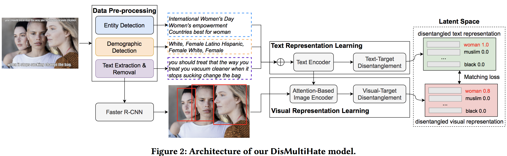

# Disentangling Hate in Online Memes
Code for ACM MM 2021 Paper: "Disentangling Hate in Online Memes" <p>

</p>

The whole work can be divided into three parts:
1. Data preprocessing
2. Baseline experiments
3. Our model

## Data preprocessing
This part is detailedly introduced in preprocessing documentary. You can access quickly in this link:  
<https://gitlab.com/bottle_shop/safe/dismultihate/-/tree/master/preprocessing>.

## Baseline experiments
Documentary called baseline demonstrates baseline experiments detailedly. You can access quickly in this link:    
<https://gitlab.com/bottle_shop/safe/dismultihate/-/tree/master/baseline>.

## Our model:Disentangling Hate in Online Memes
Download all data, preprocess data as what we described in the "Data Preprocessing" section and use the code in the "latest-implementation-disentanlge" folde, 
you can run our code. It takes about 8G memory. Note: please change the location of data in the code based on the data location on your 
own server before running our code.  

To reproduced our results, you can also simply run:
```
bash save.sh
```  

Results and required environments can be checked in this link:  
<https://gitlab.com/bottle_shop/safe/dismultihate/-/tree/master/latest-implementation-disentanlge/result>

If you would like to train your own model, you can run: 
```
python main.py
```  
All settings and hyper perameters are configurized in "latest-implementation-disentanlge/config.py". You can change configurations in the 
file or directly pass parameters through command line. For instance, if you would like to run experiments on hateful mem dataset, you can run
as: 
```
python main.py --DATASET 'mem'
```  
or you woud like to run experiments on multiOFF dataset, you can run as:
```
python main.py --DATASET 'off'
```  

## Citation 

If you find this paper useful, please cite following reference:
```
  @article{dismulti,
  title={Disentangling Hate in Online Memes},
  author={Cao, Rui and Fan, Ziqing and Lee, Roy Ka-Wei and Chong, Wen-Haw and Jiang, Jing},
  journal={Proceedings of 29th ACM International Conference on Multimedia},
  year={2021}
}
```
